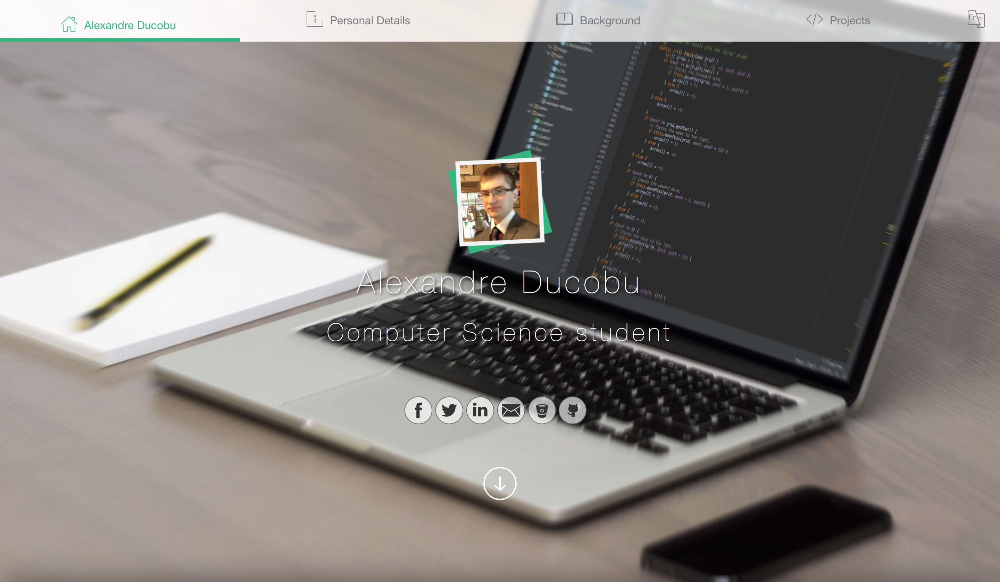

# Draft version

This is the first version of the website.  

It has been updated during the 2016-2017 school year to add some JavaScript.

This site was a first glimpse of what I could do for the project of my second year at the Haute École en Hainaut for the _Front-end development_ course.

It's made with HTML and CSS and has been validated by the W3C.  
The added JavaScript is used for the navbar and the link between each section.

