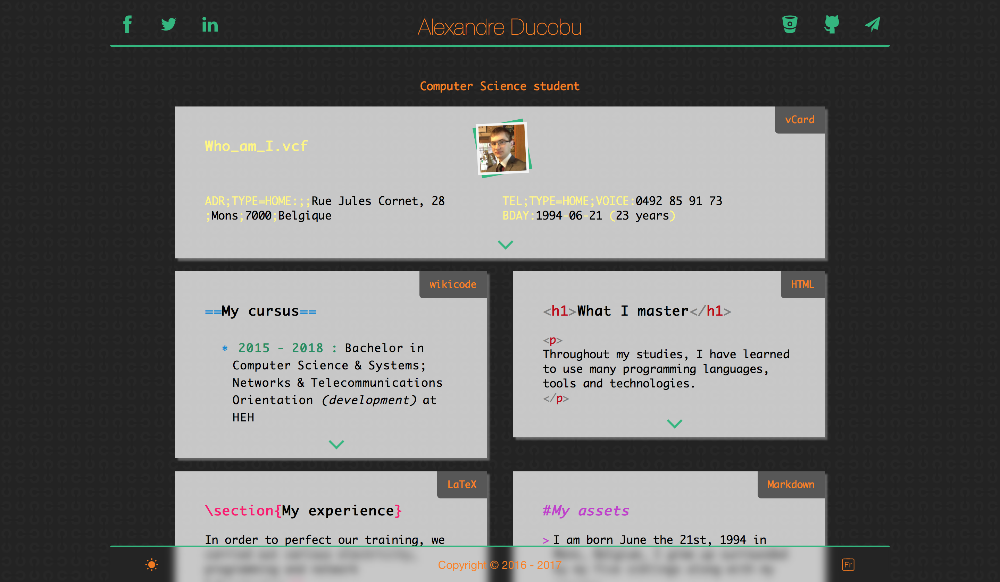

# Project version

This is the second version of the website, the one created for my second year at the Haute École en Hainaut for the _Front-end development_ course.  

It's made with HTML, CSS and JavaScript _(and jQuery)_, and has been validated by the W3C.  

It offers two themes:
- a dark theme with syntax highlighting;
- a light theme without highlighting.

Like the other version, it comes in two languages : French and English.

