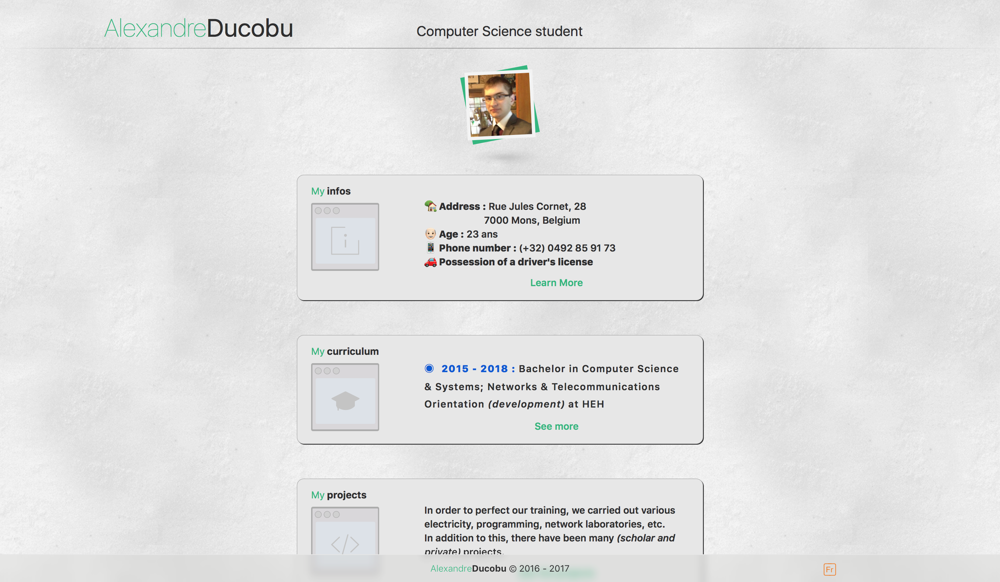

# Holidays version

This is the Third version of the website.
During the summer holidays, I created this new version to fix some issues with a new design. The main one was the display of all the projects which was pretty rough.
Now each project is separated in paragraph and the links shows if the link is available.  

It's made with HTML, CSS and JavaScript _(and jQuery)_, and has been validated by the W3C.  

Like the other versions, it comes in two languages : French and English.

