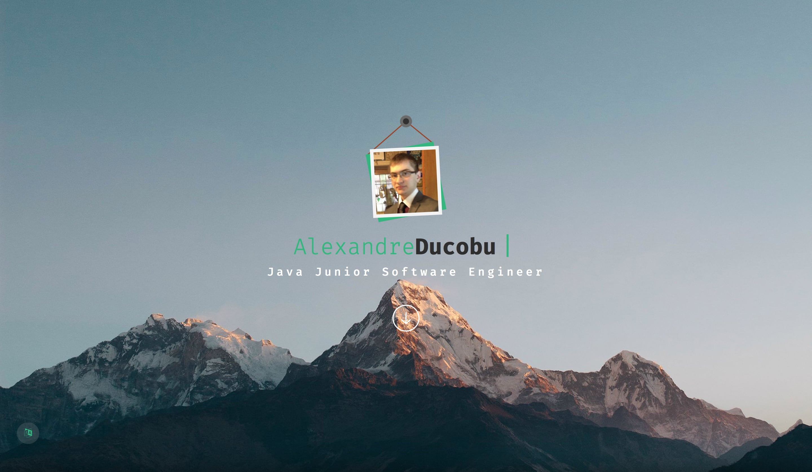

# Summers's Update 😎

This is a new version whose goal is to simplify navigation within the site.  

Following the return of the navigation bar, I have reworked the site according to the [draft](../../2015-2016) version! 😮   

It's made with HTML, CSS/Sass _(Bootstrap)_ and JavaScript _(with jQuery)_.    

Like the other versions, it comes in two languages : French and English.

This version is special! ✨.  
I used my iPad to develop this version.  
For this purpose, I used another another repo _(so, the commits aren't there...)_.  
I have thus used other tools: [Kodex](http://kodex.space), [Working Copy](https://workingcopyapp.com) and [Blink](http://www.blink.sh).

