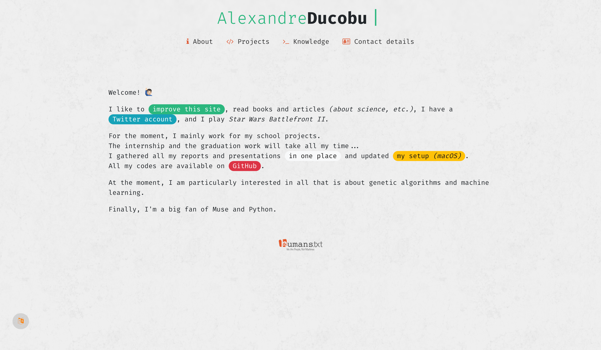

# New Year's Update ☃️

This is an updated version of [The Holidays Version](../2016-2017/2_Holidays) of the website.  

During the months after the summer, I searched to simplify the home page.
But the navigation had to stay easy… 😰
The last thing to say is that I wanted to had a _Back to the top_ feature on the *project* and *Knowledges* pages.  
It's also the return of the navbar _(updated version from the_ Draft _version)_.

It's made with HTML, CSS _(Bootstrap)_ and JavaScript _(and jQuery)_<!--, and has been validated by the W3C-->.  

Like the other versions, it comes in two languages : French and English.

